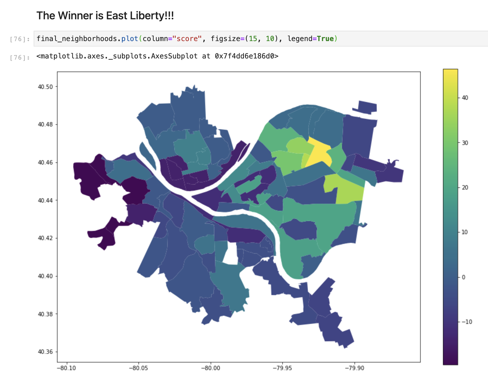

# CMPINF 0010 Final Project

### By: The Foodies (Final Project Group #1 on Canvas)

### Group Members:
* Benjamin Lannis - bwl21@pitt.edu
* Mason Hoydick - mth59@pitt.edu
* Dominic Galatis - dmg150@pitt.edu

### Datasets Used:
* Ben's Dataset: Allegheny County Supermarkets & Convenience Stores (https://data.wprdc.org/dataset/allegheny-county-supermarkets-convenience-stores)
* Mason's Dataset: Grow Pittsburgh Food Gardens (https://data.wprdc.org/dataset/grow-pittsburgh-food-gardens)
* Dom's Dataset: Restaurant/Food Facility Inspections and Locations (https://data.wprdc.org/dataset/allegheny-county-restaurant-food-facility-inspection-violations)

## Overview:

Welcome to our repository! The Jupyter notebook files document our exploration into the question: "What is the best neighborhood in Pittsburgh?" for the CMPINF 0010 Final Project at the University of Pittsburgh. In order to answer this question, we analyzed three separate datasets and compiled the results to determine which neighborhood has the best food (and consequently is the best neighborhood in the city).

*higher numbers are better in this visualization*